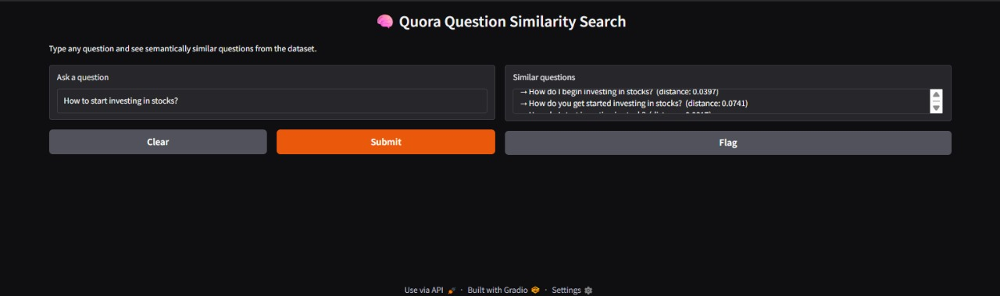

# Quora-Similar-Questions
This project identifies semantically similar questions from the Quora Question Pairs dataset using Sentence Transformers and FAISS.
It helps detect duplicate questions — similar to how Quora filters repeated queries.

**About the Project:**
This model learns the semantic meaning of questions instead of just matching keywords.
It converts each question into a numerical embedding, then uses FAISS for efficient similarity search.
A simple Gradio app allows you to input a question and instantly see the most similar ones.

**Features**
-Finds questions with similar meaning instantly
-Uses GPU acceleration for faster embedding generation
-Based on the all-MiniLM-L6-v2 SentenceTransformer model
-Interactive Gradio web interface
-Includes pre-saved FAISS index and embeddings

Example

**Input:**
-How to invest in the stock market?
**Output (Top Similar Questions):**
-How do I begin investing in stocks?
-How do you get started investing in stocks?
-What is the best way to start investing in stocks?
-How should I start investing in the stock market?

**Gradio Interface**

**Dataset**
This project uses the Quora Question Pairs Dataset which contains over 400,000 question pairs labeled as duplicate or not duplicate.

**Tech Stack**
| Tool                 | Purpose                      |
| -------------------- | ---------------------------- |
| Python               | Core programming language    |
| SentenceTransformers | Generate semantic embeddings |
| FAISS                | Fast similarity search       |
| Gradio               | Web interface                |
| Pandas / NumPy       | Data processing and storage  |

**Folder Structure**
Quora-Similarity-Project/
├── app.py
├── faiss_index.idx
├── question_embeddings.npy
├── questions.pkl
├── requirements.txt
├── assets/
│   └── gradio_demo.jpg
└── README.md

**How to Run**
Run this project easily in Google Colab: 
1. Upload your dataset to your Colab session.
2. Run each cell in order — it will load the data, create embeddings, build the FAISS index, and finally launch the Gradio app.
3. In the last cell, you can enter any question to find similar questions from the dataset.
Use a GPU runtime (Runtime → Change runtime type → GPU) for faster embedding generation.

**Possible Improvements**
Add visualization for embedding clusters (e.g., TSNE or PCA)
Extend support for multilingual question matching
Build a web-based API for easy integration

**Author**
Akshi Sharma

GitHub: https://github.com/akshisharmaaa
